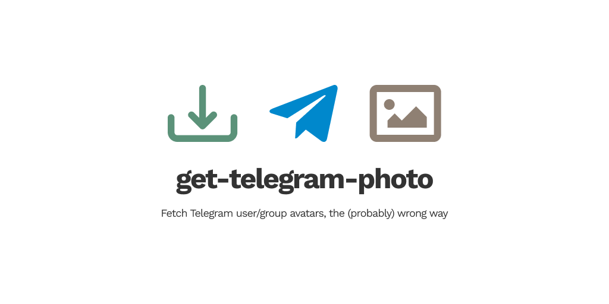

<!-- markdownlint-disable MD033 MD036 MD041 -->

[](.)

## Endpoints

- <https://get-telegram-photo.now.sh>
- <https://gtp.now.sh>

## Usage

**User**

- <https://get-telegram-photo.now.sh/surabayajs>
- <https://gtp.now.sh/surabayajs>

## Responses

**Fetch for username [`surabayajs`](https://t.me/surabayajs)**

<a href="https://gtp.now.sh/surabayajs"></a><br />

**Invalid or non-existent username**

```json
{
  "status": 500,
  "message": "username 'some_username' not found"
}
```

## How it works

Using [`got`](https://github.com/sindresorhus/got), it fetches the user/group username page on <https://t.me> and search the `.tgme_page_photo_image` selector using [`cheerio`](https://github.com/cheeriojs/cheerio). If exist, `cheerio` gets the image URL, download the image and re-serves the content and headers.

## Contributors

Thanks goes to these wonderful people ([emoji key](https://allcontributors.org/docs/en/emoji-key)):

<!-- ALL-CONTRIBUTORS-LIST:START - Do not remove or modify this section -->
<!-- prettier-ignore-start -->
<!-- markdownlint-disable -->
<table>
  <tr>
    <td align="center"><a href="https://griko.id"><br /><sub><b>Griko Nibras</b></sub></a><br /><a href="https://github.com/surabayajs/get-telegram-photo/commits?author=grikomsn" title="Code">💻</a> <a href="#maintenance-grikomsn" title="Maintenance">🚧</a></td>
  </tr>
</table>

<!-- markdownlint-restore -->
<!-- prettier-ignore-end -->

<!-- ALL-CONTRIBUTORS-LIST:END -->

## License

[MIT License, Copyright (c) 2020 SurabayaJS](./LICENSE)
